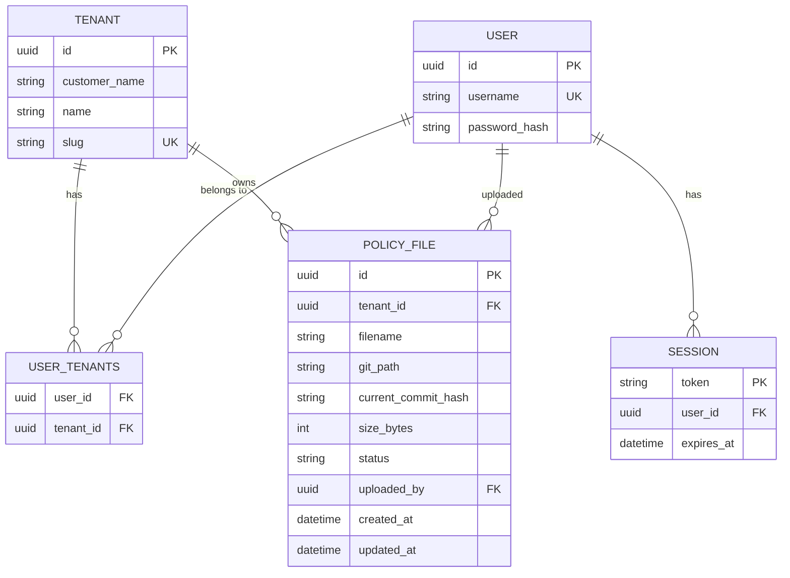

# Cedar Policy File Service

A backend service for uploading, listing, downloading, and deleting [Cedar](https://www.cedarpolicy.com/)
authorization policy files, scoped per-tenant, with strict tenant isolation.

- **Git** is the system of record for policy file *content*.
- **PostgreSQL** stores *metadata* and is the query index for listing/filtering.
- Every uploaded file is validated as syntactically valid Cedar before being accepted.

---

## Architecture

```
Client (React) ──HTTP──▶ FastAPI ──┬──▶ PostgreSQL (metadata: tenants, users, policy_files, sessions)
                                    └──▶ Git repo on disk (policy file content, one commit per write/delete)
```

**Why split storage this way?** Git gives free, real version history (every upload/delete is a commit,
attributed to the acting user) without building a custom versioning table. Postgres gives fast, indexed
querying (list files per tenant, filter by status) without shelling out to `git log` for every request.
Postgres's `PolicyFile.current_commit_hash` column links a metadata row to the exact Git commit holding
that file's content — so even if the working tree changes later, you can always ask "what did this file
look like at commit X."

### Entity-relationship diagram



`USER_TENANTS` is a many-to-many join table (a customer's users can span multiple tenants — e.g. seeded
user `alice` belongs to both `acme-prod` and `acme-staging`; `bob` belongs only to `acme-prod`).

---

## Tenant isolation — how it's enforced

Isolation is enforced at **two independent layers**, so a bug in one doesn't compromise the other:

1. **API layer** (`require_tenant_access` in `auth.py`): every tenant-scoped route takes `tenant_id` in
   the URL path and checks it's one of the *authenticated user's* tenants — returning `404` (not `403`)
   if not, so an attacker can't even confirm the tenant exists.
2. **Query layer**: for single-file operations (download, delete), the SQL filter combines
   `PolicyFile.id == file_id AND PolicyFile.tenant_id == tenant_id` in one query. This closes a subtler
   hole: `require_tenant_access` only proves the *tenant_id in the URL* belongs to the user — it says
   nothing about whether the *file_id* in the URL actually belongs to that tenant. Filtering by `id`
   alone would let a user pass their own valid tenant_id alongside another tenant's file_id and still
   retrieve it.
3. **Storage layer** (`gitstore.py`): filenames are restricted to a safe character set
   (`[A-Za-z0-9._-]+`), blocking path traversal (`../../other-tenant/file`) even if a filename ever
   reached the storage layer unsanitized from somewhere upstream.

This is deliberately defense-in-depth rather than relying on a single check.

---

## Cedar validation

Uploaded file content is parsed with [`cedarpy`](https://pypi.org/project/cedarpy/) — real Python
bindings to the Rust Cedar policy engine (not a hand-rolled syntax checker). `cedar_validate.py` calls
`cedarpy.PolicySet.from_str(text)`, which raises on:

- Non-UTF-8 content
- Empty content
- Malformed Cedar syntax (surfaces the real Cedar parser's diagnostic message)

This validates **syntax** only — that the file is well-formed Cedar. It does not validate **schema**
semantics (e.g. whether referenced entity types/actions exist in your domain model), which would require
authoring and maintaining a Cedar schema per tenant. See "Future Work" below.

---

## Setup

### Prerequisites

- Python 3.12+
- A PostgreSQL database — this project was built and tested against a **hosted Supabase** project (one
  database per project; see note below if you're using Supabase too)
- `git` CLI installed and on `PATH`

### 1. Clone and set up a virtual environment

```bash
git clone <repo-url>
cd Cedar-Policy-Backend
python3 -m venv venv
source venv/bin/activate
pip install -r requirements.txt
```

### 2. Configure environment variables

Create a `.env` file in the project root:

```
DATABASE_URL=postgresql+psycopg2://<user>:<password>@<host>:<port>/<database>
GIT_REPO_PATH=./git_repo
SEED_ALICE_PASSWORD=<choose-a-password>
SEED_BOB_PASSWORD=<choose-a-password>
SEED_CAROL_PASSWORD=<choose-a-password>
CORS_ALLOWED_ORIGINS=http://localhost:5173,http://localhost:3000
```

> **If using Supabase**: use the connection string from Project Settings → Database → Connection String
> (direct connection or session pooler, port `5432` — avoid the transaction-mode pooler on port `6543`
> for this project, since it doesn't reliably support the session-level behavior some operations here
> rely on). Supabase hosted projects give one database per project; tests use a separate Postgres
> *schema* within that same database, not a separate database — see `tests/conftest.py`.

### 3. Seed the database

```bash
python -m app.seed
```

Creates 3 tenants (`acme-prod`, `acme-staging`, `globex-prod`) and 3 users:

| Username | Password (from env) | Tenants |
|---|---|---|
| alice | `SEED_ALICE_PASSWORD` | acme-prod, acme-staging |
| bob | `SEED_BOB_PASSWORD` | acme-prod |
| carol | `SEED_CAROL_PASSWORD` | globex-prod |

### 4. Run the server

```bash
python -m app.main
```

or

```bash
uvicorn app.main:app --reload
```

API available at `http://localhost:8000`. Interactive docs (Swagger UI) at `http://localhost:8000/docs`.

---

## Running tests

```bash
pytest -v
```

or

```bash
PYTHONPATH=. pytest -v
```

Tests reuse your `.env` `DATABASE_URL`, isolated via a separate Postgres
schema (`test_smartverify`) that's created and dropped automatically —
they never touch your real seeded data. Git storage for tests uses a temp
directory, also cleaned up automatically.

In addition to the automated suite, all endpoints were manually exercised
via Swagger UI (`/docs`) and Postman during development — including
happy-path CRUD, Cedar validation rejection messages, and cross-tenant
attack scenarios (e.g. requesting another tenant's policy ID directly) —
to confirm behavior matched what the automated tests assert before
writing them, and to sanity-check responses interactively as endpoints
were built.

---

## API reference

All endpoints except `/api/health`, `/api/db-check`, and `/api/auth/login` require a bearer token
(`Authorization: Bearer <token>`) obtained from login.

| Method | Path | Description |
|---|---|---|
| GET | `/api/health` | Liveness check |
| GET | `/api/db-check` | DB connectivity check |
| POST | `/api/auth/login` | `{username, password}` → `{token, username}` |
| GET | `/api/tenants` | List tenants the authenticated user belongs to |
| POST | `/api/tenants/{tenant_id}/policy-files` | Upload a Cedar policy file (multipart `file` field) |
| GET | `/api/tenants/{tenant_id}/policy-files` | List policy files for a tenant |
| GET | `/api/tenants/{tenant_id}/policy-files/{file_id}/download` | Download a policy file's content |
| DELETE | `/api/tenants/{tenant_id}/policy-files/{file_id}` | Delete a policy file |

Upload responses `409` on duplicate filename within a tenant, `400` with a specific parser message on
invalid Cedar syntax, `404` on tenant the user doesn't belong to.

---

## Project structure

```
app/
├── main.py              # FastAPI app, CORS, startup, router registration
├── db.py                # SQLAlchemy engine/session
├── models.py             # Tenant, User, PolicyFile, Session ORM models
├── schemas.py            # Pydantic request/response models
├── auth.py                # Password verification, session tokens, get_current_user, require_tenant_access
├── cedar_validate.py      # Cedar syntax validation via cedarpy
├── gitstore.py            # Git-backed file storage (write/read/delete, path safety)
├── seed.py                # Seeds tenants + users
└── routers/
    ├── health.py
    ├── auth_routes.py
    ├── tenants.py
    └── policy_files.py
tests/
├── conftest.py            # Fixtures: isolated DB schema, temp git repo, seeded data, login helper
├── test_cedar_validate.py
├── test_gitstore.py
└── test_api.py            # Includes cross-tenant isolation tests
```

---

## Design decisions (summary — see full design doc for detail)

| Decision point | Choice | Why |
|---|---|---|
| Cedar validation | `cedarpy` (real Rust engine bindings) | Authoritative parser, not a hand-rolled regex/syntax check |
| Git library | `subprocess` + real `git` CLI | Transparent, no hidden abstraction, no extra dependency beyond `git` itself |
| Delete semantics | Hard delete (row + `git rm`) | Simpler for scope; Git history still retains the content if ever needed |
| 404 vs 403 for cross-tenant access | 404 | Doesn't confirm to an unauthorized caller that the tenant/resource exists |
| Duplicate filename on upload | 409 Conflict | Explicit versioning/overwrite is future work, not silent |
| Auth | Hardcoded bearer session tokens, no OAuth | Explicitly out of scope per requirements |

---

## Future work / bonus ideas

- **Cedar schema validation** (`cedarpy.validate_policies`) — catch semantic errors (typo'd entity types,
  invalid actions) in addition to syntax, once a per-tenant Cedar schema exists.
- **File versioning/overwrite** — allow re-uploading a filename as a new version instead of `409`, using
  Git history for diffing between versions.
- **Pagination/filtering** on the list endpoint (frontend + backend).
- **Soft delete** with restore, if audit requirements need deleted files to remain queryable.
- **Row-Level Security (RLS)** in Postgres as an additional isolation layer, since this project already
  runs on Supabase.